---
title: Library Management System
author: Moulik Bhatia (bhatiam3@myumanitoba.ca)
date: 30 September 2025
---

# Domain model
This repository contains a domain model and an initial implementation of our Library System.
It maintains a simple library and user database management and manages users, media (books and movies) along with resources (computers and study rooms) and a booking system for said resources.
Phase 2:
Added a kiosk that allows user to perform basic functions and find they way to different resources

## Resources

- I researched most of my project using different public library resources like :

1. Winnipeg library : <https://www.winnipeg.ca/recreation-leisure/libraries>
2. University Of Manitoba Library : <https://umanitoba.ca/libraries/>

## Diagram

Our domain model is a UML class diagram drawn using Mermaid.

```mermaid
classDiagram
%% ===== Core Library =====
    class Library {
        -name: String
        -description: String
        -mediaAvailable: ArrayList<MediaInterface>
        -map: Map
        -resources: ArrayList<Resource>
        +Library(name)
        +addDescription(description) void
        +addMedia(media: MediaInterface) void
        +showMedia(mediaID: int) MediaInterface
        +removeMedia(mediaID: int) void
        +printMap() void
        +getResources() ArrayList<Resource>
        +addResource(resource: Resource) void
        +showResource(resourceName: String) void
        +getName() String
        +toString() String
    }

    class Map {
        -map: char[][]
        +Map(library: Library)
        +printMap() void
        +library: Library
    }

    Library "1" *-- "1" Map : layout  %% composition (Map exists for one Library)
    Library "1"  --o "0..*" Resource : resources  %% aggregation
    Library "1" --o "0..*" MediaInterface : catalog  %% aggregation

%% ===== Media hierarchy =====
    class MediaInterface {
        <<interface>>
        +getMediaType() String
        +getCreator() String
        +getMediaGenre() MediaGenres
        +borrowMedia() boolean
        +returnMedia() void
        +getTitle() String
        +getMediaID() int
        +addCopies() void
        +addReview(review: Review) void
        +getReviews() ArrayList<Review>
    }

    class MediaGenres {
        <<enumeration>>
        HORROR
        COMEDY
        ACTION
        ROMANCE
        THRILLER
        FICTION
        NONFICTION
    }

    class Book {
        -title: String
        -author: String
        -publisher: String
        -mediaID: int
        -library: Library
        -genre: MediaGenres
        -totalCopies: int
        -issuedDays: int
        -reviews: List<Review>
        -currentlyIssuedTo: List<User>
        -waitlist: List<User>
        +Book(title: String, author: String, publisher: String, genre: MediaGenres, isbn: int, library: Library)
        +checkInvariants() void
        +getMediaType() String
        +getCreator() String
        +getMediaGenre() MediaGenres
        +borrowMedia(user: User) void
        +returnMedia() void
        +getTitle() String
        +getAvailableCopies() int
        +getLibrary() Library
        +getMediaID() int
        +addCopies() void
        +setLibrary(library: Library) void
        +mediaExists(media: MediaInterface) boolean
        +addReview(review: Review) void
        +getReviews() List<Review>
        +issueUser(user: User) boolean
        +addWaitlist(user: User) void
        +getWaitlist() List<User>
        +removeFromWaitlist(user: User) void
    }

    class Movie {
        -title: String
        -director: String
        -mediaID: int
        -library: Library
        -genre: MediaGenres
        -issuedDays: int
        -totalCopies: int
        -reviews: List<Review>
        -currentlyIssuedTo: List<User>
        -waitlist: List<User>
        +Movie(title: String, director: String, mediaID: int, library: Library, genre: MediaGenres)
        +checkInvariants() void
        +getMediaType() String
        +getCreator() String
        +getMediaGenre() MediaGenres
        +borrowMedia(user: User) void
        +returnMedia() void
        +getTitle() String
        +getAvailableCopies() int
        +getLibrary() Library
        +getMediaID() int
        +addCopies() void
        +mediaExists(media: MediaInterface) boolean
        +addReview(review: Review) void
        +getReviews() List<Review>
        +issueUser(user: User) boolean
        +addWaitlist(user: User) void
        +getWaitlist() List<User>
        +removeFromWaitlist(user: User) void
    }


    MediaInterface <|.. Book : an instance of
    MediaInterface <|.. Movie : an instance of
    Book "1" --> "1" Library : belongs to
    Movie "1" --> "1" Library : belongs to
    Book "1" --> "1" MediaGenres : describes
    Movie "1" --> "1" MediaGenres : describes

%% ===== Reviews =====
    class Review {
        <<record>>
        +user: User
        +media: MediaInterface
        +comment: String
        +stars: int
        +toString() : String
    }

    User "1" -- "0.." Review : writes >

%% ===== Users =====
    class User {
        - username: String
        - password: String
        - id: int
        - email: String
        - phone: String
        - finesDue: double
        - reviewsWritten: List<Review>
        - itemsIssued: List<MediaInterface>
        + User(username: String, password: String, id: int, email: String, phone: String)
        + checkInvariants(): void
        + getID(): int
        + getUsername(): String
        + getEmail(): String
        + getPhone(): String
        + addReview(review: Review): void
        + getReviews(): List<Review>
        + equals(otherUser: User): boolean
        + getItemsIssued(): List<MediaInterface>
        + issue(media: MediaInterface): void
        + calculateFinesDue(): double
        + checkBooksFines(): void
        + checkMovieFines(): void
        + checkBookFines(book: Book): void
        + checkMovieFines(movie: Movie): void
        + getPassword(): String
        + clearFines(): void
    }


    class UserManagement {
        -users: ArrayList<User>
        +UserManagement()
        +addUser(user: User) void
        +removeUser(id: int) void
        +userExists(id: int) User
        +getUser(id: int) User
        +getUsers() String
        +reset() void
    }
    UserManagement "1" --> "0..*" User : manages  %% aggregation

%% ===== Libraries collection =====
    class LibraryManagement {
        +libraries: ArrayList<Library>
        +addLIbrary(library: Library) void
        +getLibraries() ArrayList<Library>
        +findLibrary(name: String) Library
        +reset() void }


    LibraryManagement "1" --> "0..*" Library : catalogs

%% ===== Bookable Resources =====
    class Resource {
        <<interface>>
        +getResourceName() String
        +isAvailable(timeSlot: String) boolean
        +addBooking(booking: Booking) void
    }


    class StudyRoom {
        -roomNumber: String
        -bookings: ArrayList<Booking>
        -library: Library
        +StudyRoom(roomNumber: String, library: Library)
        +getResourceName() String
        +isAvailable(timeSlot: String) boolean
        +addBooking(booking: Booking) void
        +getBookings() ArrayList<Booking>
    }

    class Computer {
        -computerId: String
        -bookings: ArrayList<Booking>
        -library: Library
        +Computer(computerId: String, library: Library)
        +getResourceName() String
        +isAvailable(timeSlot: String) boolean
        +addBooking(booking: Booking) void
        +getBookings() ArrayList<Booking>
    }

    class TimeSlots {
        <<utility>>
        +ONE_HOUR_SLOTS: List<String>
    }


%% ===== Resource & Booking Management =====
    class Booking {
        - resource: Resource
        - user: User
        - timeSlot: TimeSlot
        + Booking(resource: Resource, user: User, timeSlot: TimeSlot)
        + getResource(): Resource
        + getUser(): User
        + getTimeSlot(): TimeSlot
    }

    class BookResource {
        - booking: Booking
        - static bookings: List~BookResource~
        + BookResource(booking: Booking)
        + checkBooking(): void
    }

    class BorrowMedia {
        + issueUser(media: MediaInterface, user: User)
    }

    class Waitlist {
        + waitlistUser(media: MediaInterface, user: User): void
    }

    class TimeSlotSearch {
        - MAX_DAYS_AHEAD: int
        + viewNextTwoWeeks(resource: Resource): List~String~
        + viewInRange(resource: Resource, start: LocalDate, end: LocalDate): List~String~
        + nextXAvailable(resource: Resource, afterTime: LocalTime, x: int): List~String~
        - parseStartTime(slot: TimeSlots): LocalTime
    }

    TimeSlotSearch --> Resource : checks
    TimeSlotSearch --> TimeSlots : uses


    Waitlist "1" --> "1" MediaInterface : manages
    Waitlist "1" --> "1" User : addsTo


    BookResource "1" --> "1" Booking : registers
    BorrowMedia "1" --> "1" MediaInterface : uses
    BorrowMedia "1" --> "1" User : issuesTo
    Booking "1" --> "1" Resource : books
    Booking "1" --> "1" User : madeBy


    Resource <|.. StudyRoom
    Resource <|.. Computer
    Booking "1" --> "1" Resource : books
    StudyRoom "1" <-- "0..*" Booking : maintains
    Computer "1" <-- "0..*" Booking : maintains
    StudyRoom "1" <-- "1" Library : located at
    Computer "1" <-- "1" Library : located at

%% ===== User Interface (KioskUI) Layer =====
    class KioskUI {
        - library: Library
        - user: User
        + showWelcomeScreen(library: Library): User
        + showUserMenu(library: Library, user: User): boolean
        - incrementIssuedDaysForAllUsers(): void
        - browseMedia(library: Library): void
        - borrowMedia(library: Library, user: User): void
        - returnMedia(library: Library, user: User): void
        - viewResources(library: Library): void
        - bookResource(library: Library, user: User): void
        - handleBooking(resource: Resource, user: User, date: LocalDate): void
        - handleFutureBooking(resource: Resource, user: User): void
        - showNextXAfterTime(resource: Resource): void
        - showRangeAvailability(resource: Resource): void
        - findPathOnMap(library: Library): void
        - findMediaOnMap(library: Library): void
        - checkFines(user: User): void
        - payFine(user: User): void
        - clearFines(user: User): void
        - promptMenu(options: String[]): int
    }

    class LogInUI {
        + promptLogin(): User
    }

    class RegisterUserUI {
        + promptRegister(): User
    }

    KioskUI --> Library : uses
    KioskUI --> User : activeUser
    KioskUI --> BorrowMedia : uses
    KioskUI --> Waitlist : uses
    KioskUI --> BookResource : uses
    KioskUI --> LogInUI : uses
    KioskUI --> RegisterUserUI : uses
    KioskUI --> Resource : books
    KioskUI --> PathFinder : navigates
    KioskUI --> PrintMap : prints
    KioskUI --> PrintMedia : displays
    KioskUI --> PrintResource : lists
    KioskUI --> TimeSlotSearch : checks
    LogInUI --> UserManagement : validates
    RegisterUserUI --> UserManagement : registers

%% ===== Pathfinding Subsystem =====
    class PathFinder {
        - PATH_CHAR: char
        - FLOOR_CHAR: char
        - START_CHAR: char
        - library: Library
        - map: char[][]
        + PathFinder(library: Library)
        + runForTarget(targetChar: char): boolean
        - dfsAndMarkPath(start: Coordinate, target: Coordinate): boolean
        - inBounds(r: int, c: int, rows: int, cols: int): boolean
        - isWalkable(r: int, c: int, rows: int, cols: int, visited: boolean[][], target: Coordinate): boolean
        - findChar(ch: char): Coordinate
        + clearPath(): void
        + printMap(): void
    }

    class Coordinate {
        - x: int
        - y: int
        + Coordinate(x: int, y: int)
        + getX(): int
        + getY(): int
        + equals(other: Coordinate): boolean
    }

    class Stack {
        <<interface>>
        + push(item: T): void
        + pop(): Object
        + size(): int
        + isEmpty(): boolean
        + peek(): Object
    }

    class LinkedListStack {
        - top: Node<T>
        - size: int
        + push(item: T): void
        + pop(): T
        + size(): int
        + isEmpty(): boolean
        + peek(): T
    }

    class EmptyStackException {
        + EmptyStackException(message: String)
    }

    PathFinder --> Library : uses
    PathFinder --> Coordinate : uses
    PathFinder --> LinkedListStack : uses
    LinkedListStack --> Stack : implements
    LinkedListStack --> EmptyStackException : throws


    class Kiosk {
        - user : User
        - library : Library
        + main(args : String[]) void
        - runKiosk() void
        - logout() void
    }

    Kiosk --> User
    Kiosk --> Library
    Kiosk --> UI
    Kiosk --> LibraryBuilder

    class RegisterUserUI {
        + promptRegister() User
    }

    RegisterUserUI --> RegisterUser
    RegisterUserUI --> InputValidation
    RegisterUserUI --> User
    class LogInUI {
        + promptLogin() User
    }

    LogInUI --> LogIn
    LogInUI --> InputValidation
    LogInUI --> User

    class TimeSlotSearch {
        - MAX_DAYS_AHEAD : int
        + viewNextTwoWeeks(resource : Resource) List<String>
        + viewInRange(resource : Resource, start : LocalDate, end : LocalDate) List<String>
        + nextXAvailable(resource : Resource, afterTime : LocalTime, x : int) List<String>
        - parseStartTime(slot : TimeSlots) LocalTime
    }

    TimeSlotSearch --> Resource
    TimeSlotSearch --> TimeSlots

    class LibraryBuilder {
        + initializeLibrary() Library
        - addMedia(library : Library) void
        - addResources(library : Library) void
    }

    LibraryBuilder --> Library
    LibraryBuilder --> Book
    LibraryBuilder --> Movie
    LibraryBuilder --> StudyRoom
    LibraryBuilder --> Computer
    LibraryBuilder --> MediaGenres

    class BookResource {
        + booking : Booking
        + bookings : ArrayList<BookResource>
        + BookResource(booking : Booking)
        + checkBooking() void
    }
    BookResource --> Booking
    BookResource --> BookingConflictException

    class BorrowMedia {
        + issueUser(media : MediaInterface, user : User) void
    }

    BorrowMedia --> MediaInterface
    BorrowMedia --> User
    BorrowMedia --> UnavailableMediaException
    BorrowMedia --> OverdueMediaException

    class Waitlist {
        + waitlistUser(media : MediaInterface, user : User) void
    }

    Waitlist --> MediaInterface
    Waitlist --> User
    class Coordinate {
        - x : int
        - y : int
        + Coordinate(x : int, y : int)
        + getX() int
        + getY() int
        + equals(other : Coordinate) boolean
    }


%% ===== Invariant properties  =====
    note for LogInUI "Invariant properties:\n- Username and password must not be blank or null "
    note for BookResource "Invariant properties:\n- booking != null for all instances.\n- No two bookings share the same resource/time slot."
    note for Kiosk "Invariant properties:\n- library != null after initialization\n- user == null or valid User\n"
    note for LibraryBuilder "Invariant properties:\n- Returned Library is never null.\n- All media/resources added are valid.\n"
    note for BorrowMedia "Invariant properties:\n- media != null and user != null."
    note for Coordinate "Invariant properties:\n- x, y immutable after construction.\n- x >= 0 and y >= 0"
    note for Library "Invariant properties:\n<ul>\n    
<li>name != null</li>\n    
<li>name.length() > 0</li>\n    
<li>description != null</li>\n    
<li>mediaAvailable != null</li>\n    
<li>resources != null</li>\n    
<li>map != null</li>\n    
<li>loop: all mediaAvailable items are unique (no duplicate object references)</li>\n    
<li>loop: all resources have unique names</li>\n</ul>"

    note for Map "Invariant properties:\n<ul>\n    
<li>map != null</li>\n    
<li>library != null</li>\n</ul>"

    note for Book "Invariant properties:\n<ul>\n    
<li>title != null</li>\n   
<li>author != null</li>\n    
<li>publisher != null</li>\n    
<li>library != null</li>\n    
<li>genre != null</li>\n    
<li>totalCopies >= 0</li>\n</ul>"

    note for Movie "Invariant properties:\n<ul>\n    
<li>title != null</li>\n    
<li>director != null</li>\n    
<li>library != null</li>\n    
<li>genre != null</li>\n   
 <li>totalCopies >= 0</li>\n</ul>"

    note for Review "Invariant properties:\n<ul>\n    
<li>user != null</li>\n    
<li>media != null</li>\n    
<li>comment != null</li>\n    
<li>stars >= 1 && stars <= 10</li>\n</ul>"

    note for User "Invariant properties:\n<ul>\n    
<li>username != null</li>\n    
<li>username.length() > 0</li>\n    
<li>id > 0</li>\n   
<li>finesDue >= 0</li>\n    
<li>itemsIssued != null</li>\n    
<li>loop: all issued item IDs are valid</li>\n</ul>"

    note for UserManagement "Invariant properties:\n<ul>\n    
<li>users != null</li>\n    
<li>loop: all user IDs are unique</li>\n</ul>"

    note for LibraryManagement "Invariant properties:\n<ul>\n    
<li>libraries != null</li>\n    
<li>loop: all libraries have unique names</li>\n</ul>"

    note for StudyRoom "Invariant properties:\n<ul>\n    
<li>roomNumber != null</li>\n    
<li>bookings != null</li>\n    
<li>library != null</li>\n   
<li>loop: each timeSlot appears at most once in bookings</li>\n</ul>"

    note for Computer "Invariant properties:\n<ul>\n    
<li>computerId != null</li>\n    
<li>bookings != null</li>\n    
<li>library != null</li>\n    
<li>loop: each timeSlot appears at most once in bookings</li>\n</ul>"

    note for Booking "Invariant properties:\n<ul>\n    
<li>resource != null</li>\n    
<li>memberName != null && memberName.length() > 0</li>\n    
<li>timeSlot != null</li>\n    
<li>timeSlot ∈ TimeSlots.ONE_HOUR_SLOTS</li>\n</ul>"

    note for TimeSlots "Invariant properties:\n<ul>\n    
<li>ONE_HOUR_SLOTS != null</li>\n    
<li>loop: all time slots are valid and unique</li>\n</ul>"

``` 

The following diagram shows the flow for the `Kiosk` interface
This flow illustrates how users navigate between menus —

```mermaid
flowchart TD

%% ========= WELCOME SCREEN =========
    subgraph WELCOME["WELCOME / LOGIN / REGISTER"]
        start[[Start Kiosk]]
        login[[Log In]]
        register[[Register New User]]
        login_result{Valid credentials?}
        register_result{Registration successful?}
        simulate[[Simulate +1 Day on Login]]
        home[[Main Menu]]
        exit[[Exit Program]]

        login_error[[Invalid Credentials]]
        register_error[[Registration Failed]]

        start --> login
        start --> register
        login --> login_result
        login_result -- Yes --> simulate --> home
        login_result -- No --> login_error --> login

        register --> register_result
        register_result -- Yes --> simulate --> home
        register_result -- No --> register_error --> register

        start --> exit
    end

%% ========= MAIN MENU =========
    subgraph MAIN["USER MAIN MENU"]
        home --> browse[[Browse Media]]
        home --> borrow[[Borrow Media]]
        home --> returnm[[Return Media]]
        home --> viewres[[View Resources]]
        home --> bookres[[Book a Resource]]
        home --> map[[Find Path on Map]]
        home --> media_map[[Find Media on Map]]
        home --> check_fine[[Check Fines]]
        home --> pay_fine[[Pay Fines]]
        home --> logout[[Log Out]]
    end

%% ========= MEDIA BROWSING =========
    subgraph BROWSE_MEDIA["Browse Media Options"]
        browse --> all[[Browse All Media]]
        browse --> movies[[Browse All Movies]]
        browse --> books[[Browse All Books]]
        browse --> director[[View by Director]]
        browse --> author[[View by Author]]
        browse --> title[[Search by Title]]
        browse --> back1[[Back to Main Menu]]

        title --> title_error[[Title Not Found]]
        title_error --> browse

        back1 --> home
    end

%% ========= BORROW MEDIA =========
    subgraph BORROW_MEDIA["Borrow Media Flow"]
        borrow --> find_media[[Enter Media ID]]
        find_media --> id_valid{Media ID Valid?}

        invalid_id[[Invalid Media ID]]
        id_valid -- No --> invalid_id --> borrow

        id_valid -- Yes --> available{Available?}
        available -- Yes --> borrow_success[[Borrow Successful]]

        available -- No --> waitlist_choice{Join Waitlist?}
        waitlist_choice -- Yes --> waitlist_added[[Added to Waitlist]]
        waitlist_choice -- No --> waitlist_declined[[Not Added]]

        borrow_success --> borrow_return[[Return to Main Menu]]
        waitlist_added --> borrow_return
        waitlist_declined --> borrow_return
        borrow_return --> home
    end

%% ========= RETURN MEDIA =========
    subgraph RETURN_MEDIA["Return Media Flow"]
        returnm --> show_borrowed[[Show Borrowed Media]]
        show_borrowed --> enter_id[[Enter Media ID]]
        enter_id --> valid_return{Valid Return?}

        invalid_return[[Media Not Issued / Invalid Return]]
        valid_return -- No --> invalid_return --> returnm

        valid_return -- Yes --> confirm_return[[Return Media]]

        confirm_return --> review_prompt[[Leave a Review?]]
        review_prompt -- Yes --> review_yes[[Add Comment and Rating]]
        review_prompt -- No --> skip_review[[Skip Review]]
        review_yes --> review_done[[Review Submitted]]
        review_done --> return_return[[Return to Main Menu]]
        skip_review --> return_return
        return_return --> home
    end

%% ========= RESOURCES & BOOKINGS =========
    subgraph BOOKING["Book Library Resources"]
        bookres --> resource_name[[Enter Resource Name]]
        resource_name --> exists{Resource Exists?}

        no_res[[Resource Not Found]]
        exists -- No --> no_res --> return_booking2[[Return to Main Menu]] --> home

        exists -- Yes --> resource_menu[[Resource Options]]

        resource_menu --> today[[Book for Today]]
        resource_menu --> future[[Book for Future Date <= 2 Weeks]]
        resource_menu --> two_week[[View All Available 2 Weeks]]
        resource_menu --> nextx[[Next X Available After Time]]
        resource_menu --> range[[View in Date Range]]
        resource_menu --> back2[[Back to Main Menu]]

        today --> booking_conflict_today{Conflict?}
        booking_error_today[[Time Slot Already Booked]]
        booking_conflict_today -- Yes --> booking_error_today --> return_booking
        booking_conflict_today -- No --> confirm_today[[Confirm Booking]]

        future --> booking_conflict_future{Conflict?}
        booking_error_future[[Time Slot Already Booked]]
        booking_conflict_future -- Yes --> booking_error_future --> return_booking
        booking_conflict_future -- No --> confirm_future[[Confirm Booking]]

        confirm_today --> return_booking
        confirm_future --> return_booking
        two_week --> return_booking
        nextx --> return_booking
        range --> return_booking
        back2 --> return_booking

        return_booking --> home
    end

%% ========= MAP PATHFINDER =========
    subgraph MAP["Library Map Pathfinder"]
        map --> dest[[Choose Destination Symbol]]
        dest --> valid_dest{Valid Destination?}
        invalid_dest[[Invalid Destination Symbol]]
        valid_dest -- No --> invalid_dest --> map

        valid_dest -- Yes --> path_found{Path Found?}
        path_found -- Yes --> show_path[[Display Path]]
        path_found -- No --> show_error[[No Path Found]]

        show_path --> return_map[[Return to Main Menu]]
        show_error --> return_map
        return_map --> home
    end

%% ========= FIND MEDIA ON MAP =========
    subgraph MEDIA_MAP["Find Media on Map"]
        media_map --> title_input[[Enter Media Title]]
        title_input --> valid_title{Valid Title?}

        invalid_title[[Invalid Title Entered]]
        valid_title -- No --> invalid_title --> media_map

        valid_title -- Yes --> found{Media Found?}
        found -- Yes --> section[[Show Section Symbol and Genre]]
        found -- No --> not_found[[Media Not Found]]

        section --> show_media_path[[Find Path on Map]]
        show_media_path --> return_media_map[[Return to Main Menu]]
        not_found --> return_media_map
        return_media_map --> home
    end

%% ========= FINES SYSTEM =========
    subgraph FINES["Check and Pay Fines"]
        check_fine --> check_issue{Any Media Issued?}
        check_issue -- No --> no_issue[[No Media Issued]]
        check_issue -- Yes --> calc_fine[[Calculate Overdue Fines]]

        calc_fine --> fine_amount{Fines Due?}
        fine_amount -- No --> no_fine[[No Overdue Fines]]
        fine_amount -- Yes --> due_display[[Display Fine Amount]]

        pay_fine --> pay_prompt[[Enter Payment Details]]
        pay_prompt --> payment_valid{Valid Payment Info?}

        payment_invalid[[Invalid Payment Information]]
        payment_valid -- No --> payment_invalid --> pay_fine

        payment_valid -- Yes --> pay_result{Payment Successful?}
        pay_result -- Yes --> return_overdue[[Return Overdue Media]]
        pay_result -- No --> cancel_pay[[Payment Cancelled]]

        return_overdue --> fines_cleared[[Clear All Fines]]

        fines_cleared --> return_fine[[Return to Main Menu]]
        cancel_pay --> return_fine
        no_issue --> return_fine
        no_fine --> return_fine
        due_display --> return_fine
        return_fine --> home
    end

%% ========= LOGOUT =========
    logout --> WELCOME


```

