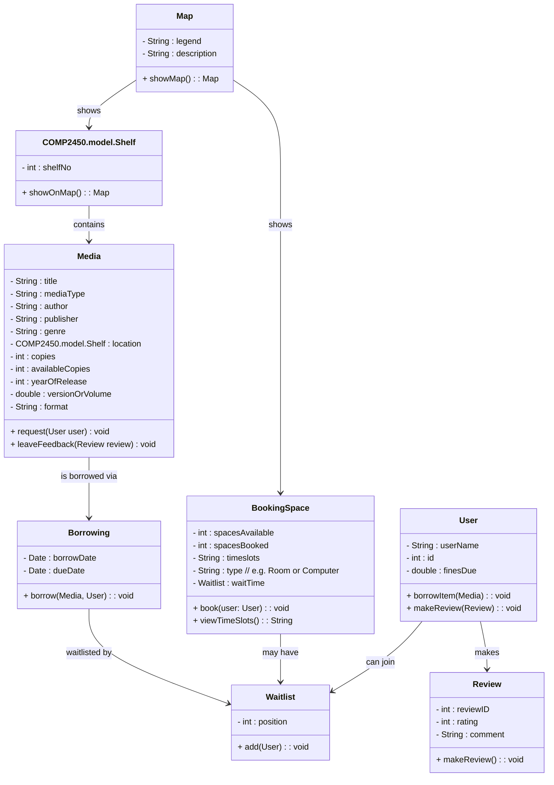

# Library Project

## Resources

- I reasearched most of my project using different public library resources like :

1. Winnipeg library : <https://www.winnipeg.ca/recreation-leisure/libraries>
2. University Of Manitoba Library : <https://umanitoba.ca/libraries/>

## Diagram

The diagram for my domain model

