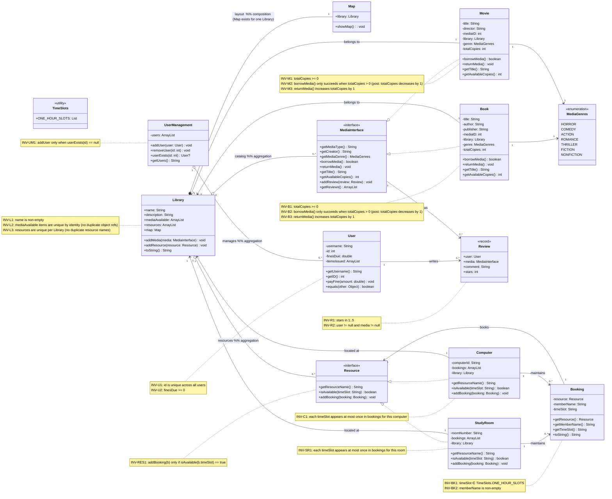

---
title: Library Management System
author: Moulik Bhatia (bhatiam3@myumanitoba.ca)
date: Fall 2025
---

# Domain model

## Resources

- I reasearched most of my project using different public library resources like :

1. Winnipeg library : <https://www.winnipeg.ca/recreation-leisure/libraries>
2. University Of Manitoba Library : <https://umanitoba.ca/libraries/>

## Diagram

Here is the diagram for my domain model

