---
title: Library Management System
author: Moulik Bhatia (bhatiam3@myumanitoba.ca)
date: 30 September 2025
---

# Domain model
This repository contains a domain model and an initial implementation of our Library System.
It maintains a simple library and user database management and manages users, media (books and movies) along with resources (computers and study rooms) and a booking system for said resources.

## Resources

- I researched most of my project using different public library resources like :

1. Winnipeg library : <https://www.winnipeg.ca/recreation-leisure/libraries>
2. University Of Manitoba Library : <https://umanitoba.ca/libraries/>

## Diagram

Our domain model is a UML class diagram drawn using Mermaid.

```mermaid
classDiagram
%% ===== Core Library =====
    class Library {
        -name: String
        -description: String
        -mediaAvailable: ArrayList<MediaInterface>
        -map: Map
        -resources: ArrayList<Resource>
        +Library(name)
        +addDescription(description) void
        +addMedia(media: MediaInterface) void
        +showMedia(mediaID: int) MediaInterface
        +removeMedia(mediaID: int) void
        +printMap() void
        +getResources() ArrayList<Resource>
        +addResource(resource: Resource) void
        +showResource(resourceName: String) void
        +getName() String
        +toString() String
    }

    class Map {
        -map: char[][]
        +Map(library: Library)
        +printMap() void
        +library: Library
    }

Library "1" *-- "1" Map : layout  %% composition (Map exists for one Library)
Library "1"  --o "0..*" Resource : resources  %% aggregation
Library "1" --o "0..*" MediaInterface : catalog  %% aggregation

%% ===== Media hierarchy =====
class MediaInterface {
    <<interface>>
    +getMediaType() String
    +getCreator() String
    +getMediaGenre() MediaGenres
    +borrowMedia() boolean
    +returnMedia() void
    +getTitle() String
    +getMediaID() int
    +addCopies() void
    +addReview(review: Review) void
    +getReviews() ArrayList<Review>
}

class MediaGenres {
  <<enumeration>>
  HORROR
  COMEDY
  ACTION
  ROMANCE
  THRILLER
  FICTION
  NONFICTION
}

class Book {
    -title: String
    -author: String
    -publisher: String
    -mediaID: int
    -library: Library
    -genre: MediaGenres
    -totalCopies: int
    +Book(title, author, publisher, genre, isbn, library)
    +getMediaType() String
    +getCreator() String
    +getMediaGenre() MediaGenres
    +borrowMedia() boolean
    +returnMedia() void
    +getTitle() String
    +getMediaID() int
    +addCopies() void
    +toString() String
}

class Movie {
    -title: String
    -director: String
    -mediaID: int
    -library: Library
    -genre: MediaGenres
    -totalCopies: int
    +Movie(title, director, mediaID, library, genre)
    +getMediaType() String
    +getCreator() String
    +getMediaGenre() MediaGenres
    +borrowMedia() boolean
    +returnMedia() void
    +getTitle() String
    +getMediaID() int
    +addCopies() void
    +toString() String
}

MediaInterface <|.. Book : an instance of
MediaInterface <|.. Movie : an instance of
Book "1" --> "1" Library : belongs to
Movie "1" --> "1" Library : belongs to
Book "1" --> "1" MediaGenres : describes
Movie "1" --> "1" MediaGenres : describes

%% ===== Reviews =====
class Review {
  <<record>>
  +user: User
  +media: MediaInterface
  +comment: String
  +stars: int
  +toString() : String
}

User "1" -- "0.." Review : writes >

%% ===== Users =====
class User {
    -username: String
    -id: int
    -finesDue: double
    -itemsIssued: ArrayList<int>
    -reviewsWritten: ArrayList<Review>
    +User(username, id)
    +addReview(review: Review) void
    +getReviews(): ArrayList<Review>
    +getUsername() String
    +getID() int
    +equals(other: Object) boolean
}

class UserManagement {
    -users: ArrayList<User>
    +UserManagement()
    +addUser(user: User) void
    +removeUser(id: int) void
    +userExists(id: int) User
    +getUser(id: int) User
    +getUsers() String
    +reset() void
}
UserManagement "1" --> "0..*" User : manages  %% aggregation

%% ===== Libraries collection =====
class LibraryManagement {
    +libraries: ArrayList<Library>
    +addLIbrary(library: Library) void
    +getLibraries() ArrayList<Library>
    +findLibrary(name: String) Library
    +reset() void }
        

LibraryManagement "1" --> "0..*" Library : catalogs

%% ===== Bookable Resources =====
class Resource {
  <<interface>>
  +getResourceName() String
  +isAvailable(timeSlot: String) boolean
  +addBooking(booking: Booking) void
}

class Booking {
    -resource: Resource
    -memberName: String
    -timeSlot: String
    +Booking(resource: Resource, memberName: String, timeSlot: String)
    +getResource() Resource
    +getMemberName() String
    +getTimeSlot() String
    +toString() String
}

class StudyRoom {
    -roomNumber: String
    -bookings: ArrayList<Booking>
    -library: Library
    +StudyRoom(roomNumber: String, library: Library)
    +getResourceName() String
    +isAvailable(timeSlot: String) boolean
    +addBooking(booking: Booking) void
    +getBookings() ArrayList<Booking>
}

class Computer {
    -computerId: String
    -bookings: ArrayList<Booking>
    -library: Library
    +Computer(computerId: String, library: Library)
    +getResourceName() String
    +isAvailable(timeSlot: String) boolean
    +addBooking(booking: Booking) void
    +getBookings() ArrayList<Booking>
}

class TimeSlots {
  <<utility>>
  +ONE_HOUR_SLOTS: List<String>
}

Resource <|.. StudyRoom
Resource <|.. Computer
Booking "1" --> "1" Resource : books
StudyRoom "1" <-- "0..*" Booking : maintains
Computer "1" <-- "0..*" Booking : maintains
StudyRoom "1" <-- "1" Library : located at
Computer "1" <-- "1" Library : located at

%% ===== Invariants  =====
note for Library "Invariant properties:\n<ul>\n    
<li>name != null</li>\n    
<li>name.length() > 0</li>\n    
<li>description != null</li>\n    
<li>mediaAvailable != null</li>\n    
<li>resources != null</li>\n    
<li>map != null</li>\n    
<li>loop: all mediaAvailable items are unique (no duplicate object references)</li>\n    
<li>loop: all resources have unique names</li>\n</ul>"

note for Map "Invariant properties:\n<ul>\n    
<li>map != null</li>\n    
<li>library != null</li>\n</ul>"

note for Book "Invariant properties:\n<ul>\n    
<li>title != null</li>\n   
<li>author != null</li>\n    
<li>publisher != null</li>\n    
<li>library != null</li>\n    
<li>genre != null</li>\n    
<li>totalCopies >= 0</li>\n</ul>"

note for Movie "Invariant properties:\n<ul>\n    
<li>title != null</li>\n    
<li>director != null</li>\n    
<li>library != null</li>\n    
<li>genre != null</li>\n   
 <li>totalCopies >= 0</li>\n</ul>"

note for Review "Invariant properties:\n<ul>\n    
<li>user != null</li>\n    
<li>media != null</li>\n    
<li>comment != null</li>\n    
<li>stars >= 1 && stars <= 10</li>\n</ul>"

note for User "Invariant properties:\n<ul>\n    
<li>username != null</li>\n    
<li>username.length() > 0</li>\n    
<li>id > 0</li>\n   
<li>finesDue >= 0</li>\n    
<li>itemsIssued != null</li>\n    
<li>loop: all issued item IDs are valid</li>\n</ul>"

note for UserManagement "Invariant properties:\n<ul>\n    
<li>users != null</li>\n    
<li>loop: all user IDs are unique</li>\n</ul>"

note for LibraryManagement "Invariant properties:\n<ul>\n    
<li>libraries != null</li>\n    
<li>loop: all libraries have unique names</li>\n</ul>"

note for StudyRoom "Invariant properties:\n<ul>\n    
<li>roomNumber != null</li>\n    
<li>bookings != null</li>\n    
<li>library != null</li>\n   
<li>loop: each timeSlot appears at most once in bookings</li>\n</ul>"

note for Computer "Invariant properties:\n<ul>\n    
<li>computerId != null</li>\n    
<li>bookings != null</li>\n    
<li>library != null</li>\n    
<li>loop: each timeSlot appears at most once in bookings</li>\n</ul>"

note for Booking "Invariant properties:\n<ul>\n    
<li>resource != null</li>\n    
<li>memberName != null && memberName.length() > 0</li>\n    
<li>timeSlot != null</li>\n    
<li>timeSlot ∈ TimeSlots.ONE_HOUR_SLOTS</li>\n</ul>"

note for TimeSlots "Invariant properties:\n<ul>\n    
<li>ONE_HOUR_SLOTS != null</li>\n    
<li>loop: all time slots are valid and unique</li>\n</ul>"

```

